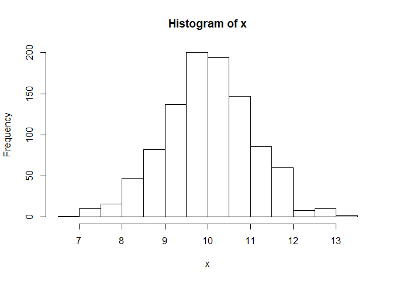
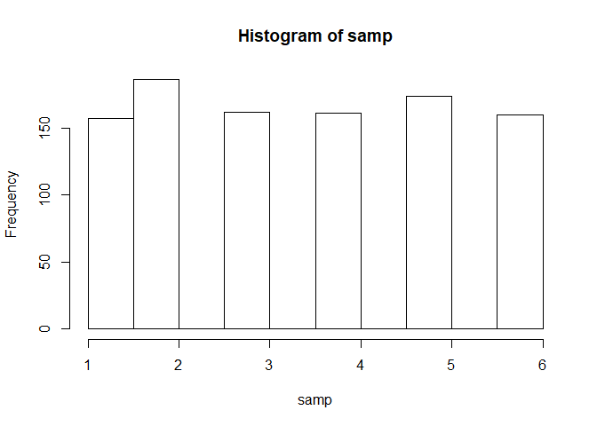
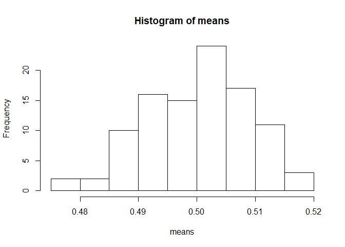
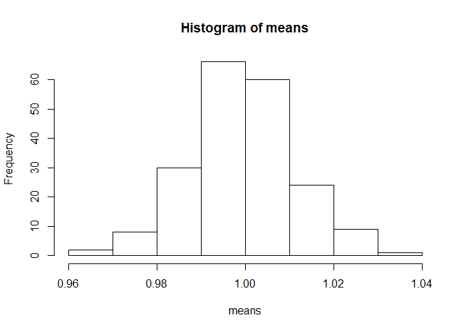
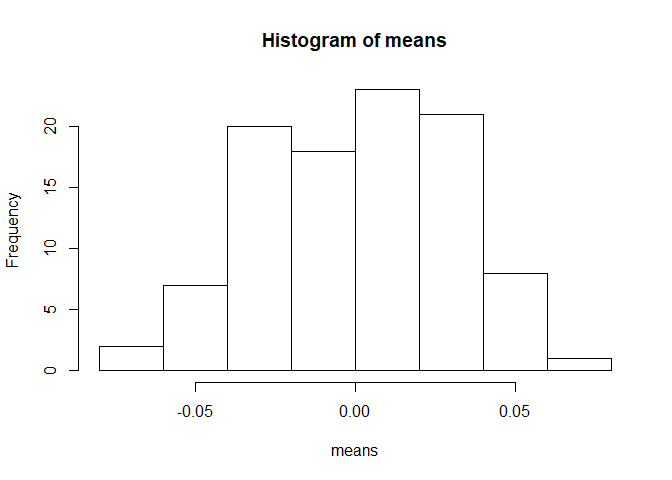
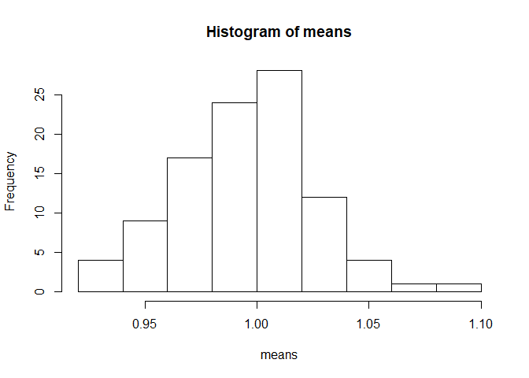

Assignment 1
================
Payton Kim
9/18/2019

### 1\. Calculate the following sums

``` r
###S1
x<- c(1:2019)
sum(x)
```

    ## [1] 2039190

``` r
###S2
sum(x^3)
```

    ## [1] 4.158296e+12

``` r
###S3
sum(x^x)
```

    ## [1] Inf

``` r
###S4
y<- c(1, -1)
alt<- (x*y)
```

    ## Warning in x * y: longer object length is not a multiple of shorter object
    ## length

``` r
sum(alt^x)
```

    ## [1] Inf

``` r
###S5
sum(1/(x^2))
```

    ## [1] 1.644439

``` r
###S6
sum(1/x)
```

    ## [1] 8.187821

``` r
###S7
sum(1/(x^3))
```

    ## [1] 1.202057

``` r
###S8
sum(1/alt)
```

    ## [1] 0.6933948

### 2\. The rnorm function generates random variables from normal distribution. Generate a sample of 1000 values from normal distribution with the mean 10 and standard deviation 1.

1.  Calculate the mean and standard deviation of the sample.
2.  Out of 1000 samples, how many do you think are that great than 10?
    Check your estimation.
3.  Use hist() function to show the histogram of the sample. d Estimate
    P(X \> 1), where X N(2, 1)

<!-- end list -->

``` r
###a
x<-rnorm(1000,10,1)
mean(x)
```

    ## [1] 10.02296

``` r
sd(x)
```

    ## [1] 1.032548

``` r
###b
### There should be about 500 greater than 10
sum(x>10)
```

    ## [1] 507

``` r
### Close to 500, or about half are greater than 10
###c
hist(x)
```

<!-- -->

``` r
###d
x<-rnorm(1000,2,1)
sum(x>1)/1000
```

    ## [1] 0.841

### 3\. Consider an experiment of tossing a fair dice.

1.  Use the sample (with replacement) function to generate a sample of
    1000 values from the experiment.
2.  Calculate the mean and standard deviation of the sample.
3.  How many times the 6 occured?
4.  Use table function to show the frequency of the values.
5.  Use prop.table(table()) to show the relative frequency of the
    values.
6.  Plot the frequency of the values.

<!-- end list -->

``` r
###a
x<- c(1:6)
samp<- sample(x, 1000, replace = TRUE)
samp
```

    ##    [1] 1 5 4 5 6 1 1 5 3 3 4 6 4 4 4 3 2 6 5 6 3 6 4 2 6 2 5 4 2 2 2 6 4 5
    ##   [35] 2 4 3 2 2 6 1 4 3 5 2 6 2 4 1 5 2 3 3 5 2 2 2 5 5 1 1 4 5 6 4 4 1 6
    ##   [69] 3 6 4 5 6 1 3 5 5 5 2 5 4 4 6 5 5 2 6 3 1 4 3 5 4 5 5 5 2 1 4 5 3 6
    ##  [103] 1 6 3 1 6 2 2 5 5 6 2 4 1 5 3 4 4 3 1 4 5 3 2 2 6 2 2 3 3 2 5 5 6 2
    ##  [137] 6 4 2 5 6 2 6 3 1 4 5 3 3 1 3 3 4 1 3 5 6 2 3 3 6 4 4 3 4 2 6 3 6 5
    ##  [171] 6 5 4 6 5 2 5 3 3 6 6 2 5 1 5 4 5 2 2 1 5 4 6 4 3 5 2 2 6 6 6 3 6 3
    ##  [205] 3 2 5 6 4 3 1 6 3 6 3 5 1 6 2 5 1 3 6 5 5 2 3 5 6 5 1 1 5 2 4 4 6 2
    ##  [239] 2 1 5 1 2 2 6 4 2 3 1 2 2 5 4 4 3 4 1 5 5 4 2 6 6 4 6 6 5 4 2 3 5 4
    ##  [273] 5 1 4 6 6 6 4 3 1 2 4 2 3 6 6 1 3 2 2 1 3 4 4 4 4 6 4 2 5 3 1 2 3 2
    ##  [307] 4 2 4 2 2 6 1 3 5 3 5 1 1 1 6 6 1 3 4 6 3 6 3 5 2 2 2 4 2 1 6 1 3 6
    ##  [341] 2 2 1 1 5 1 1 1 6 6 2 5 1 5 2 2 1 2 1 1 3 5 2 5 4 4 5 2 1 2 4 2 3 4
    ##  [375] 3 1 6 6 5 6 5 3 4 5 6 3 4 3 5 1 1 2 2 2 4 2 5 2 3 1 3 4 4 2 3 3 2 2
    ##  [409] 4 5 3 3 2 2 5 5 3 3 1 1 4 2 3 5 3 2 3 6 3 5 6 3 3 4 2 2 5 1 2 4 6 2
    ##  [443] 2 1 1 5 1 5 6 1 2 1 4 1 5 5 2 1 4 5 2 3 1 4 1 6 2 4 1 1 2 5 4 3 4 1
    ##  [477] 3 5 2 2 2 5 5 5 2 6 1 3 5 2 2 2 1 6 1 3 1 5 3 4 2 5 3 3 4 4 5 1 5 1
    ##  [511] 3 6 4 5 5 4 4 4 3 4 5 5 4 6 2 6 3 1 1 6 3 6 4 2 5 2 3 4 1 5 3 4 2 2
    ##  [545] 5 2 5 4 2 6 1 4 3 2 2 5 4 4 3 4 1 1 4 3 4 1 3 5 1 5 6 4 4 2 1 6 3 2
    ##  [579] 6 5 5 2 4 5 6 5 3 1 6 5 2 1 3 6 2 1 2 6 2 5 4 3 3 3 1 4 6 1 4 5 3 5
    ##  [613] 2 3 6 5 4 4 1 4 6 6 2 5 3 5 6 2 6 6 2 2 5 2 1 6 6 5 3 6 2 6 4 6 2 5
    ##  [647] 1 5 4 2 2 5 4 5 6 1 5 1 3 6 4 2 5 2 1 3 2 1 4 6 4 3 2 4 6 3 5 4 4 4
    ##  [681] 5 5 2 1 2 6 2 2 2 6 6 3 6 4 4 6 6 6 6 4 1 4 1 5 6 4 4 5 5 1 5 5 4 1
    ##  [715] 2 3 2 1 4 6 6 4 1 2 1 1 3 3 2 3 2 4 1 2 3 2 3 4 2 1 2 1 6 4 5 2 5 1
    ##  [749] 2 5 2 6 1 4 6 5 1 3 1 5 4 3 3 3 6 6 5 4 5 5 5 2 4 3 3 5 5 6 6 6 6 3
    ##  [783] 6 6 5 4 3 1 6 5 1 4 1 5 1 1 4 6 3 3 6 5 5 6 6 5 6 3 5 2 6 3 3 2 5 2
    ##  [817] 4 4 3 2 3 3 1 3 1 6 5 1 5 2 2 4 5 1 3 3 6 4 2 2 6 2 1 1 2 2 2 3 1 2
    ##  [851] 2 3 2 6 4 1 3 6 1 4 3 4 3 1 1 1 5 4 2 5 4 3 1 5 1 2 3 5 5 3 6 5 6 4
    ##  [885] 6 2 1 1 3 3 1 6 4 3 2 3 5 2 2 5 6 4 6 2 6 4 3 5 6 1 1 6 6 1 3 3 5 2
    ##  [919] 4 4 3 2 6 1 2 2 6 4 5 3 4 4 5 1 2 1 5 3 2 3 4 3 2 3 1 5 5 6 1 1 5 1
    ##  [953] 6 6 5 4 4 3 3 4 2 4 1 1 3 4 1 6 6 1 3 3 1 4 6 6 3 1 6 2 5 3 2 3 1 4
    ##  [987] 4 6 2 1 5 4 6 2 5 1 5 1 1 1

``` r
###b
mean(samp)
```

    ## [1] 3.489

``` r
sd(samp)
```

    ## [1] 1.69551

``` r
###c
sum(samp == 6)
```

    ## [1] 160

``` r
###d
table(samp)
```

    ## samp
    ##   1   2   3   4   5   6 
    ## 157 186 162 161 174 160

``` r
###e
freq <- prop.table(table(samp))
freq
```

    ## samp
    ##     1     2     3     4     5     6 
    ## 0.157 0.186 0.162 0.161 0.174 0.160

``` r
###f
hist(samp)
```

<!-- -->

### 4\. Consider an experiment of tossing a dice 3 times. Let X1, X2, and X3 be the number of tossing the first time, second time and third time, respectively. Use simulation to estimate the following probabilities:

1.  P(X1 \> X2 + X3)
2.  P(X21 \> X22 + X23)

<!-- end list -->

``` r
###a
rolls <- sample(1:6,3000,replace=TRUE)
outcome <- matrix(data=rolls,nrow=1000,ncol=3)
sum(outcome[,1]>outcome[,2]+outcome[,3])/1000
```

    ## [1] 0.092

``` r
###b
sum(outcome[,1]^2>((outcome[,2]^2)+(outcome[,3]^2)))/1000
```

    ## [1] 0.196

### 5\. Using simulation, estimate the probability of getting three tails in a row when tossing a coin 3 times.

``` r
toss <- sample(0:1,3000,replace=TRUE)
prob <- matrix(toss,nrow = 1000, ncol = 3)
sum((prob[,1]+prob[,2]+prob[,3])==0)/1000
```

    ## [1] 0.133

### 7\. Central Limit Theorem (CLT). The CLT said that the mean of a sample of a distribution A (no matter what A is) follows normal distribution with the same mean as A. Following the below steps to confim the CLT when A is uniform distribution.

1.  Generate 100 samples of uniform distibution from 0 to 1. Each sample
    has 1000 observations. Use the runif function to do this.
2.  Compute the means of the 100 samples. Create vector x containing
    these means. Hint: You want to put all the samples in a matrix and
    use rowSums or colSums function.
3.  By CLT, x must follow normal distribution. Check this by plotting
    the histogram of x. Does it look like normal distribution? Use
    hist(x) to plot the histogram of x.
4.  Increase the number (100 and 1000) to see if the distribution of x
    looks more like normal distribution.
5.  Try the same procedure with two other distributions for A.

<!-- end list -->

``` r
###a
unif <- runif(100000,0,1)
data <- matrix(unif, nrow=100, ncol=1000)
###b
means <- c((rowSums(data)/1000))
###c
hist(means)
```

<!-- -->

``` r
###d
unif <- runif(400000,0,1)
data <- matrix(unif, nrow=200, ncol=2000)
means <- c((rowSums(data)/1000))
hist(means)
```

<!-- -->

``` r
###e
normal <- rnorm(100000,0,1)
data <- matrix(normal,nrow=100,ncol=1000)
means <- c((rowSums(data)/1000))
hist(means)
```

<!-- -->

``` r
poisson <- rpois(100000,1)
data <- matrix(poisson,nrow=100,ncol=1000)
means <- c((rowSums(data)/1000))
hist(means)
```

<!-- -->

## Part II

7.  Use read.csv function to read in the titanic dataset. You can find
    the dataset on Blackboard or at Kaggle.com. Use str function to see
    a summary of the data.

<!-- end list -->

``` r
titanic = read.csv("C:\\Users\\student\\Downloads\\titanic.csv")
str(titanic)
```

    ## 'data.frame':    891 obs. of  12 variables:
    ##  $ PassengerId: int  1 2 3 4 5 6 7 8 9 10 ...
    ##  $ Survived   : int  0 1 1 1 0 0 0 0 1 1 ...
    ##  $ Pclass     : int  3 1 3 1 3 3 1 3 3 2 ...
    ##  $ Name       : Factor w/ 891 levels "Abbing, Mr. Anthony",..: 109 191 358 277 16 559 520 629 417 581 ...
    ##  $ Sex        : Factor w/ 2 levels "female","male": 2 1 1 1 2 2 2 2 1 1 ...
    ##  $ Age        : num  22 38 26 35 35 NA 54 2 27 14 ...
    ##  $ SibSp      : int  1 1 0 1 0 0 0 3 0 1 ...
    ##  $ Parch      : int  0 0 0 0 0 0 0 1 2 0 ...
    ##  $ Ticket     : Factor w/ 681 levels "110152","110413",..: 524 597 670 50 473 276 86 396 345 133 ...
    ##  $ Fare       : num  7.25 71.28 7.92 53.1 8.05 ...
    ##  $ Cabin      : Factor w/ 148 levels "","A10","A14",..: 1 83 1 57 1 1 131 1 1 1 ...
    ##  $ Embarked   : Factor w/ 4 levels "","C","Q","S": 4 2 4 4 4 3 4 4 4 2 ...

8.  Use knitr::kable function to nicely print out the first 10 rows of
    the data in
markdown.

<!-- end list -->

``` r
knitr::kable(head(titanic,10))
```

| PassengerId | Survived | Pclass | Name                                                | Sex    | Age | SibSp | Parch | Ticket           |    Fare | Cabin | Embarked |
| ----------: | -------: | -----: | :-------------------------------------------------- | :----- | --: | ----: | ----: | :--------------- | ------: | :---- | :------- |
|           1 |        0 |      3 | Braund, Mr. Owen Harris                             | male   |  22 |     1 |     0 | A/5 21171        |  7.2500 |       | S        |
|           2 |        1 |      1 | Cumings, Mrs. John Bradley (Florence Briggs Thayer) | female |  38 |     1 |     0 | PC 17599         | 71.2833 | C85   | C        |
|           3 |        1 |      3 | Heikkinen, Miss. Laina                              | female |  26 |     0 |     0 | STON/O2. 3101282 |  7.9250 |       | S        |
|           4 |        1 |      1 | Futrelle, Mrs. Jacques Heath (Lily May Peel)        | female |  35 |     1 |     0 | 113803           | 53.1000 | C123  | S        |
|           5 |        0 |      3 | Allen, Mr. William Henry                            | male   |  35 |     0 |     0 | 373450           |  8.0500 |       | S        |
|           6 |        0 |      3 | Moran, Mr. James                                    | male   |  NA |     0 |     0 | 330877           |  8.4583 |       | Q        |
|           7 |        0 |      1 | McCarthy, Mr. Timothy J                             | male   |  54 |     0 |     0 | 17463            | 51.8625 | E46   | S        |
|           8 |        0 |      3 | Palsson, Master. Gosta Leonard                      | male   |   2 |     3 |     1 | 349909           | 21.0750 |       | S        |
|           9 |        1 |      3 | Johnson, Mrs. Oscar W (Elisabeth Vilhelmina Berg)   | female |  27 |     0 |     2 | 347742           | 11.1333 |       | S        |
|          10 |        1 |      2 | Nasser, Mrs. Nicholas (Adele Achem)                 | female |  14 |     1 |     0 | 237736           | 30.0708 |       | C        |

9.  Use is.na function and sum function to count the total number of
    missing values in the data. Count the number of missing values in
    each columns.

<!-- end list -->

``` r
sum(is.na(titanic))
```

    ## [1] 177

``` r
sum(is.na(titanic[,1]))
```

    ## [1] 0

``` r
sum(is.na(titanic[,2]))
```

    ## [1] 0

``` r
sum(is.na(titanic[,3]))
```

    ## [1] 0

``` r
sum(is.na(titanic[,4]))
```

    ## [1] 0

``` r
sum(is.na(titanic[,5]))
```

    ## [1] 0

``` r
sum(is.na(titanic[,6]))
```

    ## [1] 177

``` r
sum(is.na(titanic[,7]))
```

    ## [1] 0

``` r
sum(is.na(titanic[,8]))
```

    ## [1] 0

``` r
sum(is.na(titanic[,9]))
```

    ## [1] 0

``` r
sum(is.na(titanic[,10]))
```

    ## [1] 0

``` r
sum(is.na(titanic[,11]))
```

    ## [1] 0

10. Calculate the average Age of the passengers. You may want to use the
    parameter na.rm = TRUE in the function mean

<!-- end list -->

``` r
avgage <- mean(titanic[,6],na.rm=TRUE)
avgage
```

    ## [1] 29.69912

11. Replace the missing values of age by the average age calculated
    previously

<!-- end list -->

``` r
newmeans <- ifelse(is.na(titanic[,6]),avgage,titanic[,6])
newmeans
```

    ##   [1] 22.00000 38.00000 26.00000 35.00000 35.00000 29.69912 54.00000
    ##   [8]  2.00000 27.00000 14.00000  4.00000 58.00000 20.00000 39.00000
    ##  [15] 14.00000 55.00000  2.00000 29.69912 31.00000 29.69912 35.00000
    ##  [22] 34.00000 15.00000 28.00000  8.00000 38.00000 29.69912 19.00000
    ##  [29] 29.69912 29.69912 40.00000 29.69912 29.69912 66.00000 28.00000
    ##  [36] 42.00000 29.69912 21.00000 18.00000 14.00000 40.00000 27.00000
    ##  [43] 29.69912  3.00000 19.00000 29.69912 29.69912 29.69912 29.69912
    ##  [50] 18.00000  7.00000 21.00000 49.00000 29.00000 65.00000 29.69912
    ##  [57] 21.00000 28.50000  5.00000 11.00000 22.00000 38.00000 45.00000
    ##  [64]  4.00000 29.69912 29.69912 29.00000 19.00000 17.00000 26.00000
    ##  [71] 32.00000 16.00000 21.00000 26.00000 32.00000 25.00000 29.69912
    ##  [78] 29.69912  0.83000 30.00000 22.00000 29.00000 29.69912 28.00000
    ##  [85] 17.00000 33.00000 16.00000 29.69912 23.00000 24.00000 29.00000
    ##  [92] 20.00000 46.00000 26.00000 59.00000 29.69912 71.00000 23.00000
    ##  [99] 34.00000 34.00000 28.00000 29.69912 21.00000 33.00000 37.00000
    ## [106] 28.00000 21.00000 29.69912 38.00000 29.69912 47.00000 14.50000
    ## [113] 22.00000 20.00000 17.00000 21.00000 70.50000 29.00000 24.00000
    ## [120]  2.00000 21.00000 29.69912 32.50000 32.50000 54.00000 12.00000
    ## [127] 29.69912 24.00000 29.69912 45.00000 33.00000 20.00000 47.00000
    ## [134] 29.00000 25.00000 23.00000 19.00000 37.00000 16.00000 24.00000
    ## [141] 29.69912 22.00000 24.00000 19.00000 18.00000 19.00000 27.00000
    ## [148]  9.00000 36.50000 42.00000 51.00000 22.00000 55.50000 40.50000
    ## [155] 29.69912 51.00000 16.00000 30.00000 29.69912 29.69912 44.00000
    ## [162] 40.00000 26.00000 17.00000  1.00000  9.00000 29.69912 45.00000
    ## [169] 29.69912 28.00000 61.00000  4.00000  1.00000 21.00000 56.00000
    ## [176] 18.00000 29.69912 50.00000 30.00000 36.00000 29.69912 29.69912
    ## [183]  9.00000  1.00000  4.00000 29.69912 29.69912 45.00000 40.00000
    ## [190] 36.00000 32.00000 19.00000 19.00000  3.00000 44.00000 58.00000
    ## [197] 29.69912 42.00000 29.69912 24.00000 28.00000 29.69912 34.00000
    ## [204] 45.50000 18.00000  2.00000 32.00000 26.00000 16.00000 40.00000
    ## [211] 24.00000 35.00000 22.00000 30.00000 29.69912 31.00000 27.00000
    ## [218] 42.00000 32.00000 30.00000 16.00000 27.00000 51.00000 29.69912
    ## [225] 38.00000 22.00000 19.00000 20.50000 18.00000 29.69912 35.00000
    ## [232] 29.00000 59.00000  5.00000 24.00000 29.69912 44.00000  8.00000
    ## [239] 19.00000 33.00000 29.69912 29.69912 29.00000 22.00000 30.00000
    ## [246] 44.00000 25.00000 24.00000 37.00000 54.00000 29.69912 29.00000
    ## [253] 62.00000 30.00000 41.00000 29.00000 29.69912 30.00000 35.00000
    ## [260] 50.00000 29.69912  3.00000 52.00000 40.00000 29.69912 36.00000
    ## [267] 16.00000 25.00000 58.00000 35.00000 29.69912 25.00000 41.00000
    ## [274] 37.00000 29.69912 63.00000 45.00000 29.69912  7.00000 35.00000
    ## [281] 65.00000 28.00000 16.00000 19.00000 29.69912 33.00000 30.00000
    ## [288] 22.00000 42.00000 22.00000 26.00000 19.00000 36.00000 24.00000
    ## [295] 24.00000 29.69912 23.50000  2.00000 29.69912 50.00000 29.69912
    ## [302] 29.69912 19.00000 29.69912 29.69912  0.92000 29.69912 17.00000
    ## [309] 30.00000 30.00000 24.00000 18.00000 26.00000 28.00000 43.00000
    ## [316] 26.00000 24.00000 54.00000 31.00000 40.00000 22.00000 27.00000
    ## [323] 30.00000 22.00000 29.69912 36.00000 61.00000 36.00000 31.00000
    ## [330] 16.00000 29.69912 45.50000 38.00000 16.00000 29.69912 29.69912
    ## [337] 29.00000 41.00000 45.00000 45.00000  2.00000 24.00000 28.00000
    ## [344] 25.00000 36.00000 24.00000 40.00000 29.69912  3.00000 42.00000
    ## [351] 23.00000 29.69912 15.00000 25.00000 29.69912 28.00000 22.00000
    ## [358] 38.00000 29.69912 29.69912 40.00000 29.00000 45.00000 35.00000
    ## [365] 29.69912 30.00000 60.00000 29.69912 29.69912 24.00000 25.00000
    ## [372] 18.00000 19.00000 22.00000  3.00000 29.69912 22.00000 27.00000
    ## [379] 20.00000 19.00000 42.00000  1.00000 32.00000 35.00000 29.69912
    ## [386] 18.00000  1.00000 36.00000 29.69912 17.00000 36.00000 21.00000
    ## [393] 28.00000 23.00000 24.00000 22.00000 31.00000 46.00000 23.00000
    ## [400] 28.00000 39.00000 26.00000 21.00000 28.00000 20.00000 34.00000
    ## [407] 51.00000  3.00000 21.00000 29.69912 29.69912 29.69912 33.00000
    ## [414] 29.69912 44.00000 29.69912 34.00000 18.00000 30.00000 10.00000
    ## [421] 29.69912 21.00000 29.00000 28.00000 18.00000 29.69912 28.00000
    ## [428] 19.00000 29.69912 32.00000 28.00000 29.69912 42.00000 17.00000
    ## [435] 50.00000 14.00000 21.00000 24.00000 64.00000 31.00000 45.00000
    ## [442] 20.00000 25.00000 28.00000 29.69912  4.00000 13.00000 34.00000
    ## [449]  5.00000 52.00000 36.00000 29.69912 30.00000 49.00000 29.69912
    ## [456] 29.00000 65.00000 29.69912 50.00000 29.69912 48.00000 34.00000
    ## [463] 47.00000 48.00000 29.69912 38.00000 29.69912 56.00000 29.69912
    ## [470]  0.75000 29.69912 38.00000 33.00000 23.00000 22.00000 29.69912
    ## [477] 34.00000 29.00000 22.00000  2.00000  9.00000 29.69912 50.00000
    ## [484] 63.00000 25.00000 29.69912 35.00000 58.00000 30.00000  9.00000
    ## [491] 29.69912 21.00000 55.00000 71.00000 21.00000 29.69912 54.00000
    ## [498] 29.69912 25.00000 24.00000 17.00000 21.00000 29.69912 37.00000
    ## [505] 16.00000 18.00000 33.00000 29.69912 28.00000 26.00000 29.00000
    ## [512] 29.69912 36.00000 54.00000 24.00000 47.00000 34.00000 29.69912
    ## [519] 36.00000 32.00000 30.00000 22.00000 29.69912 44.00000 29.69912
    ## [526] 40.50000 50.00000 29.69912 39.00000 23.00000  2.00000 29.69912
    ## [533] 17.00000 29.69912 30.00000  7.00000 45.00000 30.00000 29.69912
    ## [540] 22.00000 36.00000  9.00000 11.00000 32.00000 50.00000 64.00000
    ## [547] 19.00000 29.69912 33.00000  8.00000 17.00000 27.00000 29.69912
    ## [554] 22.00000 22.00000 62.00000 48.00000 29.69912 39.00000 36.00000
    ## [561] 29.69912 40.00000 28.00000 29.69912 29.69912 24.00000 19.00000
    ## [568] 29.00000 29.69912 32.00000 62.00000 53.00000 36.00000 29.69912
    ## [575] 16.00000 19.00000 34.00000 39.00000 29.69912 32.00000 25.00000
    ## [582] 39.00000 54.00000 36.00000 29.69912 18.00000 47.00000 60.00000
    ## [589] 22.00000 29.69912 35.00000 52.00000 47.00000 29.69912 37.00000
    ## [596] 36.00000 29.69912 49.00000 29.69912 49.00000 24.00000 29.69912
    ## [603] 29.69912 44.00000 35.00000 36.00000 30.00000 27.00000 22.00000
    ## [610] 40.00000 39.00000 29.69912 29.69912 29.69912 35.00000 24.00000
    ## [617] 34.00000 26.00000  4.00000 26.00000 27.00000 42.00000 20.00000
    ## [624] 21.00000 21.00000 61.00000 57.00000 21.00000 26.00000 29.69912
    ## [631] 80.00000 51.00000 32.00000 29.69912  9.00000 28.00000 32.00000
    ## [638] 31.00000 41.00000 29.69912 20.00000 24.00000  2.00000 29.69912
    ## [645]  0.75000 48.00000 19.00000 56.00000 29.69912 23.00000 29.69912
    ## [652] 18.00000 21.00000 29.69912 18.00000 24.00000 29.69912 32.00000
    ## [659] 23.00000 58.00000 50.00000 40.00000 47.00000 36.00000 20.00000
    ## [666] 32.00000 25.00000 29.69912 43.00000 29.69912 40.00000 31.00000
    ## [673] 70.00000 31.00000 29.69912 18.00000 24.50000 18.00000 43.00000
    ## [680] 36.00000 29.69912 27.00000 20.00000 14.00000 60.00000 25.00000
    ## [687] 14.00000 19.00000 18.00000 15.00000 31.00000  4.00000 29.69912
    ## [694] 25.00000 60.00000 52.00000 44.00000 29.69912 49.00000 42.00000
    ## [701] 18.00000 35.00000 18.00000 25.00000 26.00000 39.00000 45.00000
    ## [708] 42.00000 22.00000 29.69912 24.00000 29.69912 48.00000 29.00000
    ## [715] 52.00000 19.00000 38.00000 27.00000 29.69912 33.00000  6.00000
    ## [722] 17.00000 34.00000 50.00000 27.00000 20.00000 30.00000 29.69912
    ## [729] 25.00000 25.00000 29.00000 11.00000 29.69912 23.00000 23.00000
    ## [736] 28.50000 48.00000 35.00000 29.69912 29.69912 29.69912 36.00000
    ## [743] 21.00000 24.00000 31.00000 70.00000 16.00000 30.00000 19.00000
    ## [750] 31.00000  4.00000  6.00000 33.00000 23.00000 48.00000  0.67000
    ## [757] 28.00000 18.00000 34.00000 33.00000 29.69912 41.00000 20.00000
    ## [764] 36.00000 16.00000 51.00000 29.69912 30.50000 29.69912 32.00000
    ## [771] 24.00000 48.00000 57.00000 29.69912 54.00000 18.00000 29.69912
    ## [778]  5.00000 29.69912 43.00000 13.00000 17.00000 29.00000 29.69912
    ## [785] 25.00000 25.00000 18.00000  8.00000  1.00000 46.00000 29.69912
    ## [792] 16.00000 29.69912 29.69912 25.00000 39.00000 49.00000 31.00000
    ## [799] 30.00000 30.00000 34.00000 31.00000 11.00000  0.42000 27.00000
    ## [806] 31.00000 39.00000 18.00000 39.00000 33.00000 26.00000 39.00000
    ## [813] 35.00000  6.00000 30.50000 29.69912 23.00000 31.00000 43.00000
    ## [820] 10.00000 52.00000 27.00000 38.00000 27.00000  2.00000 29.69912
    ## [827] 29.69912  1.00000 29.69912 62.00000 15.00000  0.83000 29.69912
    ## [834] 23.00000 18.00000 39.00000 21.00000 29.69912 32.00000 29.69912
    ## [841] 20.00000 16.00000 30.00000 34.50000 17.00000 42.00000 29.69912
    ## [848] 35.00000 28.00000 29.69912  4.00000 74.00000  9.00000 16.00000
    ## [855] 44.00000 18.00000 45.00000 51.00000 24.00000 29.69912 41.00000
    ## [862] 21.00000 48.00000 29.69912 24.00000 42.00000 27.00000 31.00000
    ## [869] 29.69912  4.00000 26.00000 47.00000 33.00000 47.00000 28.00000
    ## [876] 15.00000 20.00000 19.00000 29.69912 56.00000 25.00000 33.00000
    ## [883] 22.00000 28.00000 25.00000 39.00000 27.00000 19.00000 29.69912
    ## [890] 26.00000 32.00000

``` r
titanic[is.na(titanic)] <- avgage
```

12. Remove columns Name, PassengerID, Ticket, and Cabin.

<!-- end list -->

``` r
library(dplyr)
```

    ## 
    ## Attaching package: 'dplyr'

    ## The following objects are masked from 'package:stats':
    ## 
    ##     filter, lag

    ## The following objects are masked from 'package:base':
    ## 
    ##     intersect, setdiff, setequal, union

``` r
titanic2 <- select(titanic,-1,-4,-9,-11)
```

13. Calculate the mean age of female passengers

<!-- end list -->

``` r
mean(titanic$Age[titanic$Sex == "female"])
```

    ## [1] 28.21673

14. Calculate the median fare of the passengers in Class 1

<!-- end list -->

``` r
median(titanic$Fare[titanic$Pclass == 1])
```

    ## [1] 60.2875

15. Calculate the median fare of the female passengers that are not in
    Class 1

<!-- end list -->

``` r
median(titanic$Fare[titanic$Sex == "female" & titanic$Pclass != 1])
```

    ## [1] 14.45625

16. Calculate the median age of survived passengers who are female and
    Class 1 or Class
2,

<!-- end list -->

``` r
median(titanic$Age[titanic$Survived == 1 & titanic$Sex == "female" & titanic$Pclass !=3])
```

    ## [1] 30

17. Calculate the mean fare of female teenagers survived
passengers

<!-- end list -->

``` r
mean(titanic$Fare[titanic$Sex == "female" & titanic$Age >= 13 & titanic$Age <= 19 & titanic$Survived == 1])
```

    ## [1] 49.17966

18. Calculate the mean fare of female teenagers survived passengers for
    each
class

<!-- end list -->

``` r
mean(titanic$Fare[titanic$Sex == "female" & titanic$Age >= 13 & titanic$Age <= 19 & titanic$Survived == 1 & titanic$Pclass == 1])
```

    ## [1] 107.5407

``` r
mean(titanic$Fare[titanic$Sex == "female" & titanic$Age >= 13 & titanic$Age <= 19 & titanic$Survived == 1 & titanic$Pclass == 2])
```

    ## [1] 20.00885

``` r
mean(titanic$Fare[titanic$Sex == "female" & titanic$Age >= 13 & titanic$Age <= 19 & titanic$Survived == 1 & titanic$Pclass == 3])
```

    ## [1] 8.769885

19. Calculate the ratio of Survived and not Survived for passengers who
    payed more than the average
fare

<!-- end list -->

``` r
mean(titanic$Fare)
```

    ## [1] 32.20421

``` r
survive <- sum(titanic$Survived[titanic$Survived == 1 & titanic$Fare > 32.20421])
dead <- sum(titanic$Survived[titanic$Survived == 0 & titanic$Fare > 32.20421])
survive/dead
```

    ## [1] Inf

20. Add column that standardizes the fare (subtract the mean and divide
    by standard deviation) and name it sfare

<!-- end list -->

``` r
mfare <- mean(titanic$Fare)
sdfare <- sd(titanic$Fare)
stfare <- c((titanic$Fare - mfare)/sdfare)
titanic$sfare <- stfare
head(titanic)
```

    ##   PassengerId Survived Pclass
    ## 1           1        0      3
    ## 2           2        1      1
    ## 3           3        1      3
    ## 4           4        1      1
    ## 5           5        0      3
    ## 6           6        0      3
    ##                                                  Name    Sex      Age
    ## 1                             Braund, Mr. Owen Harris   male 22.00000
    ## 2 Cumings, Mrs. John Bradley (Florence Briggs Thayer) female 38.00000
    ## 3                              Heikkinen, Miss. Laina female 26.00000
    ## 4        Futrelle, Mrs. Jacques Heath (Lily May Peel) female 35.00000
    ## 5                            Allen, Mr. William Henry   male 35.00000
    ## 6                                    Moran, Mr. James   male 29.69912
    ##   SibSp Parch           Ticket    Fare Cabin Embarked      sfare
    ## 1     1     0        A/5 21171  7.2500              S -0.5021631
    ## 2     1     0         PC 17599 71.2833   C85        C  0.7864036
    ## 3     0     0 STON/O2. 3101282  7.9250              S -0.4885799
    ## 4     1     0           113803 53.1000  C123        S  0.4204941
    ## 5     0     0           373450  8.0500              S -0.4860644
    ## 6     0     0           330877  8.4583              Q -0.4778481

21. Add categorical variable named cfare that takes value cheap for
    passengers paying less the average fare and takes value expensive
    for passengers paying more than the average fare.

<!-- end list -->

``` r
cfare <- ifelse(titanic$Fare > mean(titanic$Fare), "expensive", "cheap")
titanic$cfare <- cfare
head(titanic)
```

    ##   PassengerId Survived Pclass
    ## 1           1        0      3
    ## 2           2        1      1
    ## 3           3        1      3
    ## 4           4        1      1
    ## 5           5        0      3
    ## 6           6        0      3
    ##                                                  Name    Sex      Age
    ## 1                             Braund, Mr. Owen Harris   male 22.00000
    ## 2 Cumings, Mrs. John Bradley (Florence Briggs Thayer) female 38.00000
    ## 3                              Heikkinen, Miss. Laina female 26.00000
    ## 4        Futrelle, Mrs. Jacques Heath (Lily May Peel) female 35.00000
    ## 5                            Allen, Mr. William Henry   male 35.00000
    ## 6                                    Moran, Mr. James   male 29.69912
    ##   SibSp Parch           Ticket    Fare Cabin Embarked      sfare     cfare
    ## 1     1     0        A/5 21171  7.2500              S -0.5021631     cheap
    ## 2     1     0         PC 17599 71.2833   C85        C  0.7864036 expensive
    ## 3     0     0 STON/O2. 3101282  7.9250              S -0.4885799     cheap
    ## 4     1     0           113803 53.1000  C123        S  0.4204941 expensive
    ## 5     0     0           373450  8.0500              S -0.4860644     cheap
    ## 6     0     0           330877  8.4583              Q -0.4778481     cheap

22. Add categorical variable named cage that takes value 0 for age 0-10,
    1 for age 10-20, 2 for age 20-30, and so on

<!-- end list -->

``` r
bins <- c(0,10,20,30,40,50,60,70,80,90,Inf)
binname <- c(0,1,2,3,4,5,6,7,8,9)
titanic$cAge <- cut(titanic$Age, breaks = bins, labels = binname)
head(titanic)
```

    ##   PassengerId Survived Pclass
    ## 1           1        0      3
    ## 2           2        1      1
    ## 3           3        1      3
    ## 4           4        1      1
    ## 5           5        0      3
    ## 6           6        0      3
    ##                                                  Name    Sex      Age
    ## 1                             Braund, Mr. Owen Harris   male 22.00000
    ## 2 Cumings, Mrs. John Bradley (Florence Briggs Thayer) female 38.00000
    ## 3                              Heikkinen, Miss. Laina female 26.00000
    ## 4        Futrelle, Mrs. Jacques Heath (Lily May Peel) female 35.00000
    ## 5                            Allen, Mr. William Henry   male 35.00000
    ## 6                                    Moran, Mr. James   male 29.69912
    ##   SibSp Parch           Ticket    Fare Cabin Embarked      sfare     cfare
    ## 1     1     0        A/5 21171  7.2500              S -0.5021631     cheap
    ## 2     1     0         PC 17599 71.2833   C85        C  0.7864036 expensive
    ## 3     0     0 STON/O2. 3101282  7.9250              S -0.4885799     cheap
    ## 4     1     0           113803 53.1000  C123        S  0.4204941 expensive
    ## 5     0     0           373450  8.0500              S -0.4860644     cheap
    ## 6     0     0           330877  8.4583              Q -0.4778481     cheap
    ##   cAge
    ## 1    2
    ## 2    3
    ## 3    2
    ## 4    3
    ## 5    3
    ## 6    2

23. Show the frequency of Ports of Embarkation. It appears that there
    are two missing values in the Embarked variable. Assign the most
    frequent port to the missing ports. Hint: Use the levels function to
    modify the categories of categorical variables.

<!-- end list -->

``` r
table(titanic$Embarked)
```

    ## 
    ##       C   Q   S 
    ##   2 168  77 644

``` r
levels(titanic$Embarked)[1] <- "S"
table(titanic$Embarked)
```

    ## 
    ##   S   C   Q 
    ## 646 168  77
